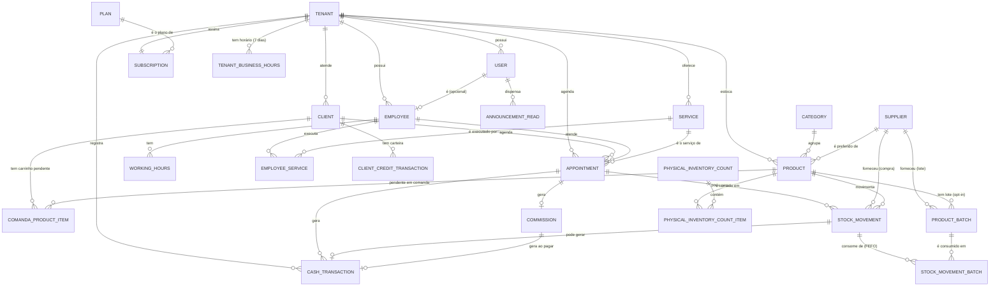

# Modelo de Dados — Zelo

Convenção: todo model marcado com 🔒 herda de `TenantModel` (tem `tenant_id` obrigatório e
passa pelo isolamento multi-tenant). Todo model financeiro/estoque guarda `created_by` e
`created_at`.

## Diagrama (visão geral)

## Entidades

### `Tenant`
| Campo | Tipo | Obs |
|---|---|---|
| id | UUID | PK |
| name | string | Nome fantasia do salão |
| slug | string, único | Usado na URL pública `/​<slug>/` |
| whatsapp | string | |
| document | string, blank | CPF ou CNPJ, validado com dígito verificador real (`apps.tenants.models.validate_cpf_cnpj`) — só pedido na hora de assinar um plano (`/painel/plano/`), é o que o Asaas exige pra criar o cliente da cobrança |
| address | string | |
| description | text | opcional |
| logo | image | |
| cover_image | image | capa exibida no topo do card da página pública, atrás da logo |
| background_image | image | fundo da página pública |
| theme | enum: salao, barbearia — default salao | ✅ *(2026-08-01, RF26e)* Escolhido no cadastro, editável em Configurações — só aparência (paleta/tipografia), ver detalhe abaixo |
| subscription_due_soon_days | int, default 7 | Configurações — janela (dias) pra `Client.subscription_is_due_soon` |
| client_inactive_days | int, default 60 | Configurações — limiar (dias sem atendimento concluído) pra `Client.is_inactive` |
| whatsapp_cancel_redirect_enabled | bool, default True | ✅ *(2026-07-31)* Configurações (RF26c) — liga/desliga o redirecionamento do cliente pro WhatsApp do salão ao cancelar (RF06f) |
| auto_confirm_appointments | bool, default False | ✅ *(2026-07-31)* Configurações (RF26d) — agendamento nasce `confirmed` em vez de `pending` (RF06i) |
| is_active | bool | desativado manualmente pelo superadmin |
| created_at | datetime | |

**`whatsapp_wa_me_number` (property, não é campo de banco):** `Tenant.whatsapp` limpo de
formatação + `55` na frente, pra montar link `wa.me` — `None` sem WhatsApp cadastrado. Usado no
RF06f; o campo `whatsapp` em si não tem validação/normalização na entrada.

**Mecanismo do `theme` (RF26e):** nenhuma lógica de negócio depende dele, é puramente visual.
Toda página Tailwind carrega sua paleta/tipografia de um `<script id="tailwind-config">` embutido
no `<head>` — só **4 templates "donos"** desse bloco de verdade: `painel/base.html` (o resto do
painel herda via ``), `public/_wizard_base.html` (fluxo de agendamento inteiro herda),
`public/home.html` e `public/booking/success.html` (standalone). Os 4 incluem
`templates/_theme_tailwind_config.html` (cores + `fontFamily` + `fontSize` + `borderRadius`,
condicional em `request.tenant.theme`) e `templates/_theme_fonts.html` (`<link>` do Google Fonts
correto) — trocar o tema não toca em nenhum outro template. Tema `barbearia` = paleta "Heritage &
Steel" (fundo `#17130f`, destaque `#fbba64`, `Archivo Narrow` + `Hanken Grotesk`), validada antes
no Google Stitch (`design-reference/barbearia/`). `plataforma/base.html` (painel do superadmin),
`painel/login.html`, `painel/signup.html` e `templates/legal/` **não** são afetados — não há um
tenant único resolvido nessas páginas.

### `TenantBusinessHours` 🔒 (horário de funcionamento do salão)
Substituiu o antigo campo livre `business_hours_note` — 1 linha por dia da semana, sempre as 7
(criadas automaticamente em `register_tenant`). Puramente informativo (não trava agendamento —
ver [[WorkingHours]] do funcionário pra isso).

| Campo | Tipo | Obs |
|---|---|---|
| tenant | FK Tenant | |
| weekday | int (0=Seg..6=Dom) | mesma convenção de `WorkingHours.weekday` |
| is_closed | bool | quando true, `start_time`/`end_time` ficam `null` |
| start_time | time, null | |
| end_time | time, null | |
| _constraint_ | unique(tenant, weekday) | |

### `Plan`
Plano de assinatura da plataforma — editável pelo superadmin em `/plataforma/planos/`, exibido
e assinável pelo tenant em `/painel/plano/` (RF41/§4.2). 3 planos seedados via
`billing/migrations/0005_seed_plans.py` (Essencial/Profissional/Ilimitado).

| Campo | Tipo | Obs |
|---|---|---|
| name | string, único | |
| description | string | |
| price | decimal | preço mensal |
| is_active | bool | some da lista de planos atribuíveis quando desativado |
| order | int | ordem de exibição |
| created_at | datetime | |

⚠️ Diferenciação entre planos (nº de funcionários, estoque profissional) hoje é **só texto de
marketing** (`apps.billing.views.PLAN_HIGHLIGHTS`), exibido na vitrine — nenhum campo de limite
real existe ainda, nenhum tenant é bloqueado por plano. Campos propostos, ainda não criados:

| Campo proposto | Tipo | Obs |
|---|---|---|
| max_employees | int, null | limite de `Employee` ativo no tenant; null = ilimitado |
| stock_professional_enabled | bool | libera fornecedor/lote/custo médio/inventário (RF43-46) — hoje todo tenant já tem acesso, sem gate nenhum |

### `Subscription` (billing / Asaas)
Nasce automaticamente em `register_tenant` com `trial_ends_at` = 14 dias corridos à frente
(`apps.billing.services.TRIAL_DAYS`). Tenant assina self-service em `/painel/plano/`
(`apps.billing.services.get_or_create_checkout_url`) — cria cliente + assinatura no Asaas e
preenche `asaas_customer_id`/`asaas_subscription_id` de verdade; webhook
(`POST /webhooks/asaas/`) atualiza `status` daí em diante. Superadmin continua podendo mudar
tudo manualmente em `/plataforma/` (usado hoje porque `ASAAS_API_KEY` ainda está vazia no
`.env` — ver `01-REQUISITOS.md` §4.2).

| Campo | Tipo | Obs |
|---|---|---|
| tenant | FK Tenant (1:1) | |
| plan | FK Plan, PROTECT, null=True | escolhido pelo tenant (`billing:select_plan`) ou atribuído manualmente pelo superadmin |
| asaas_customer_id | string | preenchido no 1º checkout (`asaas_client.create_customer`) |
| asaas_subscription_id | string | preenchido no 1º checkout (`asaas_client.create_subscription`) |
| status | enum: trialing, **pending**, active, overdue, canceled | `pending` = novo (checkout criado no Asaas, aguardando webhook confirmar o 1º pagamento) |
| trial_ends_at | datetime, null | fim do trial de 14 dias, setado em `register_tenant`. RF30 ✅ *(2026-07-31)* — passado esse horário, `apps.billing.services.subscription_blocks_panel_access` bloqueia o painel (sem tolerância extra) se `status` continuar `trialing`; nenhum job muda o `status` sozinho, é só comparado a cada request |
| grace_period_days | int, default 5 | RF30 ✅ — dias de carência após `current_period_end` antes de `apps.billing.services.subscription_blocks_panel_access` bloquear o painel de uma assinatura `overdue` |
| current_period_start | date, null | atualizado pelo webhook (`PAYMENT_CONFIRMED`/`PAYMENT_RECEIVED`) ou manualmente pelo superadmin quando não há cobrança recorrente (`Subscription.is_recurring`) |
| current_period_end | date, null | idem, `current_period_start` + 30 dias |
| created_at | datetime | |
| updated_at | datetime | |

**Exibição no painel:** além de `/painel/plano/`, o plano atual + dias restantes aparecem no
menu lateral inteiro (embaixo do e-mail/nome do salão), calculado a cada request por
`apps.billing.context_processors.sidebar_plan` (não é campo de banco) — ver
`01-REQUISITOS.md` §4.2.

### `AsaasWebhookEvent`
Log de dedupe do webhook — `unique_together(payment_id, event_type)` garante que um reenvio do
Asaas (acontece se o endpoint não responde 200 a tempo) não reprocessa o mesmo evento duas
vezes. Puramente técnico, não é exibido em nenhum painel.

| Campo | Tipo | Obs |
|---|---|---|
| payment_id | string | id do `Payment` no Asaas |
| event_type | string | ex: `PAYMENT_CONFIRMED` |
| received_at | datetime | |
| _constraint_ | unique(payment_id, event_type) | é essa constraint que faz a dedupe (`IntegrityError` capturado em `apps.billing.services._record_webhook_event`) |

### `Announcement`
Aviso de atualização do app, criado pelo superadmin em `/plataforma/avisos/` — broadcast pra
**todos** os tenants (sem alvo por tenant). Visível só a `tenant_admin` (sininho no painel).

| Campo | Tipo | Obs |
|---|---|---|
| title | string | |
| message | text | |
| is_active | bool | avisos antigos podem ser desativados |
| created_by | FK User, SET_NULL | |
| created_at | datetime | |

### `AnnouncementRead`
Leitura é por **usuário** (não por tenant) — cada `tenant_admin` dispensa a sua própria.

| Campo | Tipo | Obs |
|---|---|---|
| announcement | FK Announcement, CASCADE | |
| user | FK User, CASCADE | |
| read_at | datetime | |
| _constraint_ | unique(announcement, user) | |

### `TenantNotification` 🔒 *(implementado em 2026-07-31 — RF06g)*
Alerta operacional de **um** tenant — diferente de `Announcement` (broadcast pra todos). Nasce
de um evento dentro do próprio salão; hoje só `apps.scheduling.services.cancel_appointment`
gera um, quando `canceled_by_client=True`. Leitura é direto no registro (`is_read`/`read_at`),
sem tabela de join por usuário — só o(s) `tenant_admin`(s) daquele salão veem.

| Campo | Tipo | Obs |
|---|---|---|
| tenant | FK Tenant | |
| kind | enum (`TenantNotificationKind`) | só `appointment_canceled_by_client` gerado hoje — enum já extensível pro roadmap de notificar toda mudança de agenda (RF06h) |
| title | string | |
| message | text | |
| appointment | FK Appointment, SET_NULL, null=True | referência opcional — sobrevive se o agendamento for removido |
| is_read | bool | |
| read_at | datetime, null | |
| created_at | datetime | |

### `User` (custom, `AbstractUser`)
| Campo | Tipo | Obs |
|---|---|---|
| id | UUID | |
| email | string, único | usado como login |
| tenant | FK Tenant, null=True | null apenas para superadmin |
| role | enum: superadmin, tenant_admin, employee | |
| is_active | bool | |

### `Employee` 🔒
| Campo | Tipo | Obs |
|---|---|---|
| tenant | FK Tenant | |
| user | FK User (1:1) | criado automaticamente no cadastro |
| full_name | string | |
| photo | image | perfil público |
| bio | text | opcional, aparece na página pública |
| phone | string | |
| default_commission_type | enum: percentage, fixed | |
| default_commission_value | decimal | percentual (0-100) ou valor R$, conforme tipo |
| is_active | bool | |

### `WorkingHours` 🔒 (jornada do funcionário)
| Campo | Tipo | Obs |
|---|---|---|
| employee | FK Employee | |
| weekday | int (0=Seg..6=Dom) | |
| start_time | time | |
| end_time | time | |
| is_active | bool | permite desativar um dia sem apagar |

### `ScheduleException` 🔒 (folgas/bloqueios pontuais — opcional no MVP, mas já modelar)
| Campo | Tipo | Obs |
|---|---|---|
| employee | FK Employee | |
| date | date | |
| start_time / end_time | time, null=True | null = dia inteiro bloqueado |
| reason | string | opcional |

### `Service` 🔒
| Campo | Tipo | Obs |
|---|---|---|
| tenant | FK Tenant | |
| name | string | |
| description | text | |
| duration_minutes | int | usado para calcular slots de agenda |
| price | decimal | |
| is_active | bool | |
| — unique_together | (tenant, name) | evita serviço duplicado no mesmo salão |

### `EmployeeService` 🔒 (vínculo funcionário↔serviço)
| Campo | Tipo | Obs |
|---|---|---|
| employee | FK Employee | |
| service | FK Service | |
| commission_type | enum: percentage, fixed, null | null = usa o padrão do funcionário |
| commission_value | decimal, null | override específico deste serviço |
| — unique_together | (employee, service) | |

### `Client` 🔒 (cliente final, identificado por telefone — CRM)
| Campo | Tipo | Obs |
|---|---|---|
| tenant | FK Tenant | |
| phone | string | identificador dentro do tenant — propriedade `whatsapp_url` (`wa.me/55<phone>`) retorna `None` quando o telefone foi anonimizado (LGPD, formato `removido-{pk}`) |
| name | string | |
| preferences | text | texto livre (alergia, produto preferido, observações) |
| is_subscriber | bool | mensalista |
| subscription_due_date | date, null | vencimento MENSAL (não data de início) — propriedades `subscription_is_overdue`/`subscription_is_due_soon` |
| credit_balance | decimal | **derivado**, nunca editado direto — só via `ClientCreditTransaction`/serviços de `apps/clients/services.py` |
| created_at | datetime | |
| — unique_together | (tenant, phone) | mesmo telefone pode existir em tenants diferentes |

**Propriedades computadas ✅ *(`subscription_is_due_soon` e `is_inactive` ajustados/criados em
2026-07-31)*** — nenhuma é campo de banco:
- `subscription_is_overdue` — `subscription_due_date < hoje`.
- `subscription_is_due_soon` — vence dentro de `Tenant.subscription_due_soon_days` dias
  (Configurações, default 7; antes era `7` fixo no código).
- `last_appointment_date` — data do último `Appointment` com `status=completed` do cliente
  (`None` se nunca teve um concluído).
- `is_inactive` — sem atendimento concluído há `Tenant.client_inactive_days` dias
  (Configurações, default 60); conta a partir de `created_at` se o cliente nunca voltou.
  Badge "Inativo" na lista de Clientes (`templates/painel/clients/list.html`).

**Campanha de cobrança por WhatsApp ✅ *(implementado em 2026-07-31, `/painel/clientes/
mensalistas/whatsapp/`)*** — modal (botão "Cobrar mensalistas", ao lado de "Novo Cliente")
lista mensalista vencido ou a vencer (selectbox), cada um com mensagem pronta (editável)
gerada em `apps/clients/views.py::_default_campaign_message` (copy, não regra de negócio —
mesmo tratamento de `apps.billing.views.PLAN_HIGHLIGHTS`); "Enviar e ir pro próximo" abre
`wa.me/55<phone>?text=<mensagem>` num loop client-side (Alpine.js, sem round-trip por
cliente). Só entram clientes com telefone válido (exclui anonimizado LGPD).

### `ClientCreditTransaction` 🔒 (ledger da carteira de crédito do cliente)
Recarregar gera `CashTransaction` real (categoria `client_credit_topup`) — o dinheiro entrou de
verdade. Usar o crédito depois (comanda) só abate saldo, NÃO gera nova `CashTransaction` (evita
contar receita duas vezes — decisão do usuário).

| Campo | Tipo | Obs |
|---|---|---|
| tenant | FK Tenant | |
| client | FK Client, PROTECT | |
| type | enum: in, out | reaproveita `CashFlowType` |
| amount | decimal | |
| reason | string | "Recarga", "Uso em atendimento", "Ajuste manual", "Estorno" |
| related_appointment | FK Appointment, PROTECT, null | setado quando o crédito foi usado pra pagar uma comanda |
| related_cash_transaction | FK CashTransaction, PROTECT, null | setado quando a recarga gerou entrada real de caixa |
| created_by | FK User, null | |
| created_at | datetime | |

### `Appointment` 🔒
| Campo | Tipo | Obs |
|---|---|---|
| tenant | FK Tenant | |
| client | FK Client | |
| employee | FK Employee | |
| service | FK Service | |
| date | date | |
| start_time / end_time | time | end_time calculado por `service.duration_minutes` |
| status | enum: pending, confirmed, in_progress, completed, canceled, no_show | `in_progress` = "Em Atendimento" (cliente chegou, comanda aberta no Caixa) |
| price_at_booking | decimal | snapshot do preço no momento (preço pode mudar depois) |
| notes | text | opcional |
| canceled_by_client | bool, default False | ✅ *(2026-07-31)* true quando o próprio cliente cancelou pela página pública (RF06f) — distingue de cancelamento pelo admin, pro badge "Cancelado pelo cliente" na Agenda |
| created_at | datetime | |
| created_by | FK User, null | null se criado pelo cliente na página pública |

### `Category` 🔒 (categoria de produto)
| Campo | Tipo | Obs |
|---|---|---|
| tenant | FK Tenant | |
| name | string | |
| — unique_together | (tenant, name) | |

Exclusão bloqueada (`PROTECT` em `Product.category`) enquanto houver produto vinculado —
reatribuir os produtos antes de excluir a categoria.

### `Product` 🔒
| Campo | Tipo | Obs |
|---|---|---|
| tenant | FK Tenant | |
| name | string | |
| sku | string | |
| category | FK Category, PROTECT, null=True | opcional no model, obrigatório no form do painel |
| supplier | FK Supplier, SET_NULL, null=True | fornecedor preferido (opcional, RF43) |
| unit | enum: un, ml, l, g, kg, cx, par | `WHOLE_UNIT_CODES = {un, par, cx}` só aceitam quantidade inteira (validado em qualquer venda) |
| cost_price | decimal | **custo médio (RF45)** — trava (não editável manualmente) assim que `has_purchase_history` é True; só muda via recálculo automático numa compra |
| sale_price | decimal | |
| current_stock | decimal | **derivado**, sempre recalculado via `StockMovement` |
| min_stock_alert | decimal | |
| tracks_batches | bool, default False | opt-in (RF44) — nem todo produto vence (ex. toalha) |
| is_active | bool | |

### `StockMovement` 🔒
| Campo | Tipo | Obs |
|---|---|---|
| tenant | FK Tenant | |
| product | FK Product, PROTECT | |
| type | enum: in, out | entrada/saída |
| quantity | decimal | |
| unit_price | decimal | preço no momento do movimento |
| total_value | decimal | `quantity * unit_price` |
| reason | enum: purchase, sale, service_use, adjustment, loss | |
| supplier | FK Supplier, SET_NULL, null=True | fornecedor **desta compra específica** (RF43) — pode diferir do preferido em `Product.supplier` |
| related_appointment | FK Appointment, null | |
| created_by | FK User | |
| created_at | datetime | |

### `Supplier` 🔒 (fornecedor, RF43)
| Campo | Tipo | Obs |
|---|---|---|
| tenant | FK Tenant | |
| name | string | |
| contact_name | string, blank | |
| phone | string, blank | |
| email | string, blank | |
| notes | text, blank | |
| is_active | bool | |
| — unique_together | (tenant, name) | |

### `ProductBatch` 🔒 (lote/validade, RF44)
Aberto a cada `StockMovement` de compra (`type=in, reason=purchase`) quando
`Product.tracks_batches` é True — exige `expiry_date`. Saída desconta por FEFO (lote mais
próximo do vencimento primeiro) entre os lotes com saldo.

| Campo | Tipo | Obs |
|---|---|---|
| tenant | FK Tenant | |
| product | FK Product, PROTECT | |
| batch_number | string, blank | número/código do lote (livre) |
| expiry_date | date | |
| quantity_received | decimal | snapshot da quantidade recebida nessa compra |
| quantity_remaining | decimal | **derivado**, abatido a cada saída que consumir deste lote |
| supplier | FK Supplier, SET_NULL, null | |
| unit_cost | decimal | custo da compra que abriu o lote |
| received_at | datetime | |

### `StockMovementBatch` 🔒 (rastro de consumo de lote, RF44)
Uma saída pode esgotar um lote e continuar consumindo do próximo (FEFO) — por isso é uma tabela
à parte e não uma FK direta em `StockMovement`.

| Campo | Tipo | Obs |
|---|---|---|
| tenant | FK Tenant | |
| movement | FK StockMovement, CASCADE | |
| batch | FK ProductBatch, PROTECT | |
| quantity | decimal | quantidade consumida deste lote por este movimento |

### `PhysicalInventoryCount` 🔒 (contagem de inventário físico, RF46)
| Campo | Tipo | Obs |
|---|---|---|
| tenant | FK Tenant | |
| status | enum: in_progress, completed | fechada = não editável mais |
| started_at | datetime | |
| completed_at | datetime, null | |
| created_by | FK User, null | |
| notes | text, blank | |

### `PhysicalInventoryCountItem` 🔒 (RF46)
1 linha por produto ativo, congelada no início da contagem.

| Campo | Tipo | Obs |
|---|---|---|
| tenant | FK Tenant | |
| count | FK PhysicalInventoryCount, CASCADE | |
| product | FK Product, PROTECT | |
| expected_quantity | decimal | snapshot de `Product.current_stock` no início da contagem |
| counted_quantity | decimal, null | preenchido pelo admin (pode ficar em branco até contar) |
| — constraint | unique(count, product) | |

Ao fechar a contagem: todo item com `counted_quantity` preenchido e diferente de
`expected_quantity` gera um `StockMovement` automático (`reason=adjustment`, `type=in` se
sobrou, `type=out` se faltou) — sem model novo pra isso, reusa `register_stock_movement`. Itens
deixados em branco (produto não contado nesta rodada) são ignorados.

### `CashTransaction` 🔒 (caixa)
| Campo | Tipo | Obs |
|---|---|---|
| tenant | FK Tenant | |
| type | enum: in, out | entrada/saída |
| category | enum: service_sale, product_sale, commission_payment, client_credit_topup, expense, other | `client_credit_topup` = recarga de crédito do cliente (entrada real de caixa) |
| amount | decimal | |
| payment_method | enum: cash, pix, credit_card, debit_card, client_credit, other | `client_credit` NUNCA aparece aqui de fato — `_validate_cash_transaction` rejeita explicitamente (pagar com crédito não gera `CashTransaction`, ver `Client.credit_balance` abaixo); o valor existe no enum só por uso interno/histórico |
| description | string | |
| related_appointment | FK Appointment, null | |
| related_stock_movement | FK StockMovement, null | |
| related_commission | FK Commission, null | |
| created_by | FK User | |
| created_at | datetime | |

### `Commission` 🔒
| Campo | Tipo | Obs |
|---|---|---|
| tenant | FK Tenant | |
| employee | FK Employee | |
| appointment | FK Appointment (1:1) | |
| commission_type | enum: percentage, fixed | snapshot do tipo usado no cálculo |
| commission_value | decimal | snapshot do valor/percentual usado |
| base_amount | decimal | valor do serviço sobre o qual incidiu |
| calculated_amount | decimal | valor final da comissão |
| status | enum: pending, paid | |
| paid_at | datetime, null | |

### `ComandaProductItem` 🔒 (carrinho de produto pendente da comanda)
Produto adicionado a uma comanda em andamento, ainda NÃO vendido de verdade — sem
`StockMovement`/`CashTransaction` ainda. Existir como registro no banco (não só em memória no
navegador) é o que garante que sobrevive a trocar de aba/página antes de fechar a conta. Um botão
só de "Vender produto" por comanda (por CLIENTE, não por serviço/atendimento) — vira venda real
(e é apagado) só quando `complete_client_comanda` finaliza a comanda.

| Campo | Tipo | Obs |
|---|---|---|
| tenant | FK Tenant | |
| client | FK Client | |
| product | FK Product, PROTECT | |
| quantity | decimal | |
| created_by | FK User, null | |
| created_at | datetime | |
| _constraint_ | unique(client, product) | clicar de novo no mesmo produto não duplica a linha |

## Entidades planejadas — Estoque profissional (ver `01-REQUISITOS.md` §4.1)

`Supplier`, `ProductBatch`, `StockMovementBatch`, `PhysicalInventoryCount` e
`PhysicalInventoryCountItem` (RF43-46) já foram implementadas — ver as entidades acima, na seção
principal. Fica pendente só o RF47 (relatório de giro/curva ABC — sem model novo, adiado pra
depois) e, fora deste plano, a ficha técnica por serviço (RF48).

## Regras de cálculo (documentar no código também, não só aqui)

- `Commission.calculated_amount`:
  - se `commission_type == percentage`: `base_amount * (commission_value / 100)`
  - se `commission_type == fixed`: `commission_value`
- Prioridade de comissão: `EmployeeService.commission_value` (se definido) > `Employee.default_commission_value`.
- `Product.current_stock` nunca é editado diretamente — sempre resultado de soma/subtração de
  `StockMovement` (garantir isso via `service` de domínio, não permitir edição direta no admin
  de estoque atual).
- Pagamento de comanda com crédito do cliente pode ser PARCIAL: `credit_amount` abate primeiro do
  serviço, depois de cada produto na ordem informada, até esgotar — o restante de cada categoria
  vira `CashTransaction` normal. Ver RF16b em `01-REQUISITOS.md`.
- *(planejado, RF45)* Custo médio ponderado: `novo_custo = (estoque_atual × custo_atual +
  qtd_comprada × custo_da_compra) ÷ (estoque_atual + qtd_comprada)`, recalculado a cada
  `StockMovement` de entrada.
